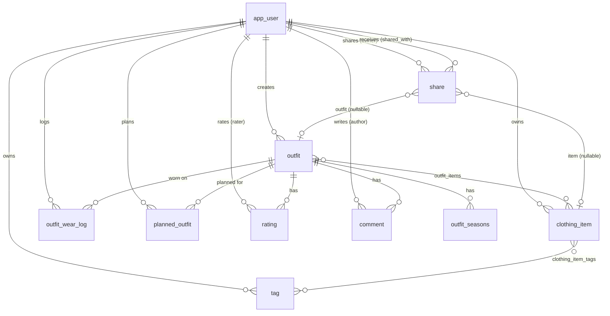

# Data model

All persistent state lives in nine JPA entities in `com.trousseau.model`, listed in the `TrousseauPU` persistence unit. Photos and receipts are stored in the database, not on disk.

- [Entity relationship diagram](#entity-relationship-diagram)
- [Entities](#entities)
- [Enums](#enums)
- [Read-only projections](#read-only-projections)
- [Cascades and deletion](#cascades-and-deletion)
- [Schema management](#schema-management)

---

## Entity relationship diagram

---

## Entities

Every entity has a `Long id` (identity-generated). Every entity except `Tag` and `OutfitWearLog` has a `created_at` timestamp set in `@PrePersist`. Lombok generates `equals`/`hashCode` on `id` only.

### `User` → `app_user`

| Column | Type | Constraints / notes |
|---|---|---|
| `username` | varchar(50) | unique, not null, 3–50 chars |
| `email` | varchar(100) | unique, nullable, `@Email` |
| `password_hash` | varchar(255) | bcrypt |
| `display_name` | varchar(100) | defaults to username on insert |
| `latitude`, `longitude` | double | nullable; both set = weather on |
| `location_name` | varchar(100) | display label for the location |
| `password_reset_token` | varchar(100) | SHA-256 hash (base64url) of the emailed token, never the token itself; nullable; cleared after use |
| `password_reset_expires_at` | timestamp | nullable |
| `credentials_version` | int, **nullable** | Incremented on every password change; sessions with an older value are signed out. `NULL` reads as 0. |
| `created_at` | timestamp | |

Named queries: `findByUsername`, `findByEmail`, `findAll`, `search` (case-insensitive LIKE on username/display name, currently unused), `findByPasswordResetToken`.

### `ClothingItem` → `clothing_item`

| Column | Type | Notes |
|---|---|---|
| `owner_id` | FK → app_user | not null |
| `name` | varchar(100) | not null |
| `description` | text | ≤ 500 chars (validated) |
| `category`, `color` | varchar(50) | category from a fixed list in `ClothingItemService.getCategories()`; colour is free text |
| `brand` | varchar(100) | |
| `size` | varchar(20) | |
| `image_data` | LOB, lazy | original photo |
| `image_content_type`, `image_name` | varchar | |
| `thumbnail_data` | LOB, lazy | ≤ 400 px JPEG; null if the original is already small |
| `wear_count` | int | lifetime wears |
| `wears_since_wash` | int, **nullable** | `NULL` reads as 0 |
| `wash_after_wears` | int | default 3; 0 disables wash alerts |
| `needs_wash` | boolean | |
| `last_worn_date`, `last_washed_date` | date | |
| `purchase_price` | numeric(12,2) | nullable |
| `purchase_date` | date | nullable |
| `status` | varchar(20), **nullable** | `ItemStatus` name; `NULL` reads as `ACTIVE` |
| `retired_on` | date | set when retired, cleared on reactivate |
| `retired_note` | varchar(200) | |
| `receipt_data` | LOB, lazy | image or PDF |
| `receipt_content_type`, `receipt_name` | varchar | |
| `created_at` | timestamp | |

Join table **`clothing_item_tags`** (`clothing_item_id`, `tag_id`). `ClothingItem` is the owning side.

Named queries `findByOwner`, `findByOwnerAndCategory`, `findNeedingWash` and `findByTag` return **in-rotation items only** (`status IS NULL OR status = 'ACTIVE'`). `findAllByOwner` includes retired items, and `findRetiredByOwner` returns only retired ones. All of them fetch tags eagerly.

### `Tag` → `tag`

| Column | Notes |
|---|---|
| `owner_id` | FK → app_user |
| `name` | varchar(50) |

Unique on (`owner_id`, `name`). Tags are private to each user.

### `Outfit` → `outfit`

| Column | Notes |
|---|---|
| `creator_id` | FK → app_user |
| `name` | varchar(100), not null |
| `description` | text |
| `occasion` | varchar(100). The UI offers Casual, Formal, Business, Sport, Date Night, Party, Other. |
| `created_at` | |

- **`outfit_seasons`** (`outfit_id`, `season` varchar(50)): element collection of `Spring` / `Summer` / `Fall` / `Winter`. Unique on (`outfit_id`, `season`), since it is a set; Hibernate 7 added this constraint to databases created by older versions.
- **`outfit_items`** (`outfit_id`, `clothing_item_id`): ordered `List<ClothingItem>`. `Outfit` is the owning side, and `ClothingItem` has no inverse mapping.
- `ratings` and `comments`: `@OneToMany(cascade = ALL, orphanRemoval = true)`.

### `Rating` → `rating`

| Column | Notes |
|---|---|
| `outfit_id` | FK → outfit |
| `rater_id` | FK → app_user |
| `rating_type` | varchar(30), `RatingType` name |
| `score` | int, 1–5 |

Unique on (`outfit_id`, `rater_id`, `rating_type`).

### `Comment` → `comment`

`outfit_id` FK, `author_id` FK, `text` (text, not null), `created_at`.

### `Share` → `share`

| Column | Notes |
|---|---|
| `owner_id` | FK → app_user (the sharer) |
| `shared_with_id` | FK → app_user (the recipient) |
| `clothing_item_id` | FK → clothing_item, nullable |
| `outfit_id` | FK → outfit, nullable |

Exactly one of `clothing_item_id` / `outfit_id` is set. This is enforced by `ShareService`, not by the database. Duplicate shares are rejected in `ShareService` via `ShareDao.exists()`. There is no unique constraint.

### `OutfitWearLog` → `outfit_wear_log`

`outfit_id` FK, `user_id` FK, `worn_date` (date, not null; defaults to today). One row per "wore this outfit on this day". Several rows for the same outfit and date are allowed.

### `PlannedOutfit` → `planned_outfit`

| Column | Notes |
|---|---|
| `user_id` | FK → app_user |
| `outfit_id` | FK → outfit |
| `plan_date` | date |
| `manually_chosen` | boolean: user override vs generated suggestion |
| `created_at` | |

Unique on (`user_id`, `plan_date`).

---

## Enums

**`ItemStatus`**: stored as a string.

| Value | Display | Meaning |
|---|---|---|
| `ACTIVE` | Active | In the wardrobe and available to wear |
| `ARCHIVED` | Archived | Kept, but out of rotation (stored or off-season) |
| `DONATED` | Donated | Given away |
| `SOLD` | Sold | Sold on |

`isRetired()` is true for everything except `ACTIVE`.

**`RatingType`**: `PERSONAL` ("Personal"), `SPOUSE_PARTNER` ("Spouse/Partner"), `FRIENDS_OTHER` ("Friends/Other").

---

## Read-only projections

These are not entities. They are filled by JPQL constructor expressions (`SELECT NEW …`) so that reports never load BLOB columns.

| Class | Fields | Used by |
|---|---|---|
| `ClothingItemSummary` | id, name, category | Item pickers on the outfit pages |
| `ItemWearStat` | id, name, category, wearCount, lastWornDate, purchasePrice (+ derived costPerWear, daysSinceWorn) | Insights item lists |
| `CategoryWearStat` | category, itemCount, totalWears (+ wearsPerItem) | Insights "Wears by Category" |
| `OutfitWearStat` | id, name, occasion, wearCount | Insights "Most Worn Outfits" |
| `MonthlyWearStat` | month, wearCount | Insights activity chart |
| `DayForecast` | date, max/min °C, precipitation mm (+ isWet ≥ 1 mm) | Planner (built from Open-Meteo JSON) |

---

## Cascades and deletion

| Deleting… | Also deletes (JPA cascade) | Blocked by foreign keys from |
|---|---|---|
| `User` | their `ClothingItem`s, `Outfit`s, `Tag`s | `share`, `rating`, `comment`, `outfit_wear_log`, `planned_outfit` rows referencing the user |
| `Outfit` | its `Rating`s, `Comment`s, `outfit_items` and `outfit_seasons` rows | **`planned_outfit`, `outfit_wear_log`, `share`** |
| `ClothingItem` | its `clothing_item_tags` rows | **`outfit_items`, `share`** |
| `Tag` | nothing | `clothing_item_tags` |

The bold entries are reachable from the UI and are not cleaned up first, so those deletes fail with a constraint violation. See [Development → Known bugs](development.md#known-bugs). There is no UI for deleting users or tags.

---

## Schema management

`persistence.xml` sets `hibernate.hbm2ddl.auto=update`:

- On first deployment, all tables, foreign keys and unique constraints are created.
- On later deployments, **new** tables and columns are added. Nothing is ever dropped, renamed or retyped.
- New columns are added as nullable to existing rows. Entity code must cope with `NULL` in any column added after the first release. The current examples are `ClothingItem.status`, `wears_since_wash` and `User.credentials_version`. Follow the same pattern (boxed type plus a null-safe getter, and `IS NULL OR …` in queries) when adding columns.

There are no migration scripts and no Flyway/Liquibase. A change that needs data migration, a type change or a rename must come with a manual SQL script and a note in the release.

The dialect is detected from JDBC metadata, so do not add `hibernate.dialect` unless you are dropping support for one of the two databases.
