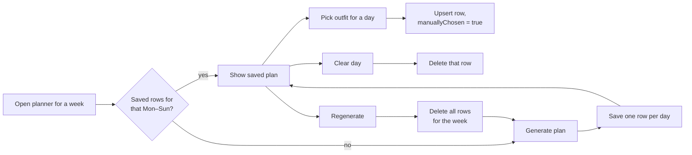

# How it works

This page gives the exact rules behind Trousseau's automatic behaviour: wash tracking, the weekly planner, cost per wear, insights and photo handling. It is written for users who want to know why the app did something, and for developers changing the logic.

- [Wear and wash tracking](#wear-and-wash-tracking)
- [Weekly planner](#weekly-planner)
- [Cost per wear](#cost-per-wear)
- [Insights](#insights)
- [Outfit wear statistics](#outfit-wear-statistics)
- [Ratings](#ratings)
- [Photos and thumbnails](#photos-and-thumbnails)

---

## Wear and wash tracking

Each clothing item keeps these counters (see `ClothingItem`):

| Field | Meaning |
|---|---|
| `wearCount` | Lifetime wears. Never reset. |
| `wearsSinceWash` | Wears since the item was last marked washed |
| `washAfterWears` | Threshold set by the user (default 3; 0 = never flag) |
| `needsWash` | The flag that puts the item in the laundry basket |
| `lastWornDate`, `lastWashedDate` | Dates of the last wear and last wash |

**Recording a wear** (`ClothingItem.recordWear()`):

```
wearCount      += 1
wearsSinceWash += 1
lastWornDate    = today
if washAfterWears > 0 and wearsSinceWash >= washAfterWears:
    needsWash = true
```

**Marking washed** (`markWashed()`): `needsWash = false`, `wearsSinceWash = 0`, `lastWashedDate = today`.

**Retiring** an item also clears `needsWash`, so retired items never sit in the laundry basket.

A wear is recorded on an item in three ways:

1. **Record Wear** on the wardrobe card or the item detail page.
2. **Record Wear** on an outfit: one wear on **every** item in the outfit, plus one outfit wear-log entry.
3. **Record wear** on a planner day: same as 2, for that day's outfit and date.

In cases 2 and 3 the outfit log entry uses the chosen date, but each item's `lastWornDate` is set to **today**, whatever date was chosen.

The **laundry basket** is every in-rotation item with `needsWash = true`.

---

## Weekly planner

Implemented in `WeeklyPlannerService`.

### Plan lifecycle



- Plans are saved in `planned_outfit`, at most one row per user per date.
- A week counts as "planned" if **any** of its days has a row. A week where you cleared some days stays partly empty; it is not refilled automatically.
- The Sunday email calls the same `getOrCreateWeekPlan()`, so the email and the page always agree.

### Choosing an outfit for each day

Candidates are **all of the user's outfits**. They are shuffled first, so ties go a different way on each run, which is why **Regenerate** gives a new plan. Then, for each day from Monday to Sunday, the outfit with the highest score is picked:

| | Freshness | Weather fit | Colour variety |
|---|---|---|---|
| No forecast for that day | **0.70** | — | **0.30** |
| Forecast available | **0.45** | **0.35** | **0.20** |

Without a forecast the weights are the same as before weather support existed, so an offline server plans exactly as it always did. Weather is decided per day: a week can mix days with and without a forecast.

Limitations of this greedy approach:

- An outfit's freshness is based on the items' **current** state. The planner does not simulate the wears it is planning, so the same outfit can be picked several times in a week. The colour term only discourages repeating it on **consecutive** days.
- Outfits containing retired items are still candidates.

### Freshness

The mean over the outfit's items of:

| Item state | Contribution |
|---|---|
| `needsWash` | **−1.0** |
| `wearsSinceWash = 0` | **+1.0** |
| otherwise | `1 − wearsSinceWash / threshold` |

`threshold` is the item's `washAfterWears`, or 3 when that is 0. An outfit with no items scores 0.5.

### Colour variety

Each item's `color` is lowercased and looked up in a fixed table of colour families:

| Colour | Families |
|---|---|
| red, orange | warm, bright, bold |
| pink, yellow | warm, bright, light |
| green, teal | cool, nature, muted |
| blue | cool, calm, muted |
| navy | cool, calm, dark |
| purple | cool, bold, rich |
| brown | warm, neutral, dark |
| beige, cream | warm, neutral, light |
| white | neutral, light, bright |
| grey, gray | neutral, muted, calm |
| black | neutral, dark, bold |

Any other colour text (e.g. "Dark blue", "olive") contributes nothing.

The outfit's families are the union over its items. The score is the **Jaccard distance** to the previous day's chosen outfit: `1 − |A ∩ B| / |A ∪ B|`. So 1.0 means no families in common, and 0.0 means identical. Monday, and any comparison where neither outfit has a recognised colour, scores 0.5.

### Weather fit

Only used when the user has a location and a forecast exists for that date (see [Setup → Weather](setup-and-deployment.md#weather-forecasts)).

```
weatherScore = 0.65 × seasonFit + 0.35 × rainFit
```

**Season fit** compares the day's **maximum** temperature with a typical temperature for each season tag:

| Tag | Centre |
|---|---|
| Winter | 2 °C |
| Fall | 12 °C |
| Spring | 16 °C |
| Summer | 26 °C |

For each tag: `fit = clamp(1 − |Tmax − centre| / 14, 0, 1)`. The outfit's season fit is its **best** tag, so tagging an outfit Spring *and* Summer widens its range instead of averaging it down. Outfits with no recognised season tags score 0.5: no information is treated as neutral, not as a bad match.

Example at 20 °C: Summer → 1 − 6/14 = 0.57; Spring → 1 − 4/14 = 0.71; Fall → 0.43; Winter → 0.

**Rain fit**: a day is wet when the forecast precipitation is **≥ 1.0 mm**. On a wet day, outfits containing an item in the *Outerwear* category score 1.0 and others 0.2. Dry days score 0.5 for everyone.

The forecast card shows the rounded maximum temperature and "· rain" on wet days.

---

## Cost per wear

```
costPerWear = purchasePrice / max(wearCount, 1)      (2 decimal places, half-up)
```

An item that has never been worn is costed as if worn once, so it reports its full price. That puts unworn purchases at the expensive end of the ranking, where they belong. Items without a price have no cost per wear and are left out of the ranking.

Ranking is done in Java, not SQL, because `max(wearCount, 1)` can't be written portably for both H2 and PostgreSQL.

---

## Insights

All figures come from data the app already records. The page never writes anything. "In rotation" means status `ACTIVE` (or `NULL` from older rows).

| Figure | Definition | Includes retired items? |
|---|---|---|
| Clothing Items | Count of items | No |
| Outfits | Count of outfits | — |
| Item Wears | Sum of `wearCount` across items | **Yes** |
| Outfits Logged | Count of outfit wear-log entries | — |
| Tracked Spend | Sum of `purchasePrice` | **Yes** |
| Wear Activity | Outfit wear-log entries per calendar month, current month and the 5 before it. Empty months show 0. | — |
| Most Worn Items | Top 10 by `wearCount`, ties by name | No |
| Most Worn Outfits | Top 10 outfits by wear-log entries | — |
| Never Worn | `wearCount = 0`, oldest-added first, max 10 | No |
| Gathering Dust | `wearCount > 0` and last worn more than **90 days** ago, longest-unworn first, max 10 | No |
| Wears by Category | Per category: item count, total wears, wears per item (1 dp). Empty category shows as "Uncategorised". | **Yes** |
| Best / Worst Value | Priced items ranked by cost per wear, 10 each | **Yes**, deliberately: a retired item's final cost per wear is often the most useful number |

**Item Wears vs Outfits Logged**: wearing a 4-item outfit once adds 4 to Item Wears and 1 to Outfits Logged. Wears recorded directly on an item add to Item Wears only.

---

## Outfit wear statistics

The outfit detail page shows:

- **This month**: wear-log entries from the 1st to the last day of the current calendar month.
- **This season**: entries in the current meteorological season of the current year. Spring = Mar–May, Summer = Jun–Aug, Fall = Sep–Nov, Winter = 1 Dec – 28 Feb (crossing the year boundary).
- **Recent history**: the latest 10 entries, newest first.

---

## Ratings

- Each rating is a score of 1–5 for one of three perspectives: `PERSONAL`, `SPOUSE_PARTNER`, `FRIENDS_OTHER`.
- A user has at most one rating per perspective per outfit (a database unique constraint). Submitting again overwrites it.
- **Outfit detail** shows the average for each perspective and an **Overall Average** = mean of the perspective averages that exist. Perspectives are weighted equally, however many ratings each has.
- **Outfit list** stars show the mean of **all** individual ratings, truncated to a whole number. This can differ from the detail page's Overall Average.

---

## Photos and thumbnails

Photos and receipts are stored in the database as BLOBs, and the entity fields are lazy-loaded.

When a photo is attached (`ClothingItemService.attachImage()` or any save), `ImageUtil.createThumbnail()` runs:

1. Decode with `ImageIO`. If the bytes are not a readable image, stop. No thumbnail is created, but the upload still succeeds.
2. If both sides are ≤ 400 px, stop. The original is small enough to use directly.
3. Scale so the longest side is 400 px, keeping the aspect ratio, with bilinear interpolation.
4. Paint any transparency onto white and encode as JPEG.

Grids, outfit cards and planner tiles use `#{imageStreamer.thumbnail}`. Only the item detail page loads the full-size original. For photos uploaded before thumbnails existed, the thumbnail is generated and saved the first time it is requested, so no migration is needed.

Imported photos have their thumbnails regenerated on save. Thumbnails are never stored in export files.
